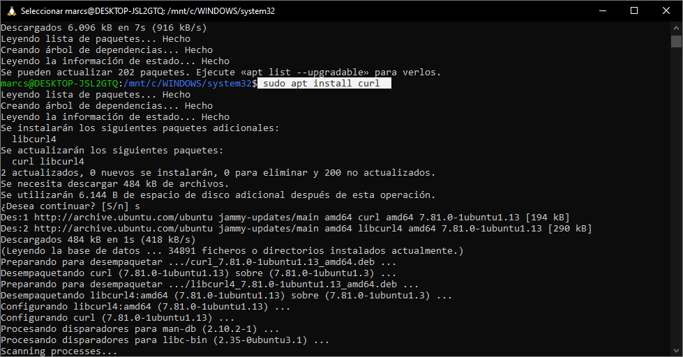
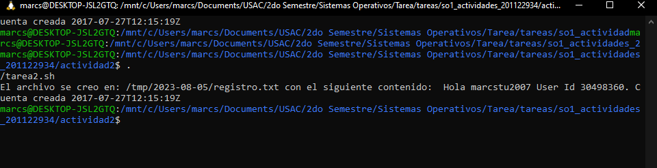

# Tarea 2

## Instrucciones:
Lea la variable GITHUB_USER
Consulte la URL https://api.github.com/users/ concatenando el valor de la variable GITHUB_USER al final
Imprimir el mensaje: “Hola <github_user>. User ID: <id>. Cuenta fue creada el: <created_at>.” Los valores entre los signos <> deben de ser tomados del JSON colsutado previamente.
Crear un log file en /tmp/<fecha>/saludos.log con la salida del mensaje anterior. Donde <fecha> corresponde a la fecha del día de ejecución del script
Actualizar los paquetes

## Instalación de herramientas:
### Actualizar dependencias
Actualizar dependencias de linux
~~~
sudo apt update
~~~

### Instalación de Curl
Nos permitira realizar peticiones al servidor
~~~
sudo apt install curl
~~~

## Codigo de bash

~~~
#!/bin/bash
GITHUB_TOKEN="marcstu2007"
# Verificar que se proporcionó un token de acceso a la API de GitHub
if [ -z "$GITHUB_TOKEN" ]; then
  echo "Error: Debes proporcionar un token de acceso a la API de GitHub en la variable de entorno GITHUB_TOKEN."
  exit 1
fi

# URL de la API de GitHub para obtener información del usuario autenticado
api_url="https://api.github.com/users/$GITHUB_TOKEN"

# Realizar la solicitud GET a la API de GitHub
response=$(curl -s $api_url)

# Verificar si la solicitud fue exitosa
if [ $? -ne 0 ]; then
  echo "Error: No se pudo obtener la información del usuario desde la API de GitHub."
  exit 1
fi

# Obtener la información
username=$(echo "$response" | grep -oP '"login": "\K[^"]+')
user_id=$(echo "$response" | grep -oP '"id": \K\d+')
fecha_creacion=$(echo "$response" | grep -oP '"created_at": "\K[^"]+')
fecha_actual=$(date +%Y-%m-%d)

# Directorio de destino
DIRECTORIO_DESTINO="/tmp/$fecha_actual"
mkdir -p "$DIRECTORIO_DESTINO"

# Muestra la información del usuario obtenida.
echo "Hola $username User Id $user_id. Cuenta creada $fecha_creacion" > "$DIRECTORIO_DESTINO/registro.txt"
echo "El archivo se creo en: $DIRECTORIO_DESTINO/registro.txt con el siguiente contenido:  Hola $username User Id $user_id. Cuenta creada $fecha_creacion"
~~~
En ejecución
